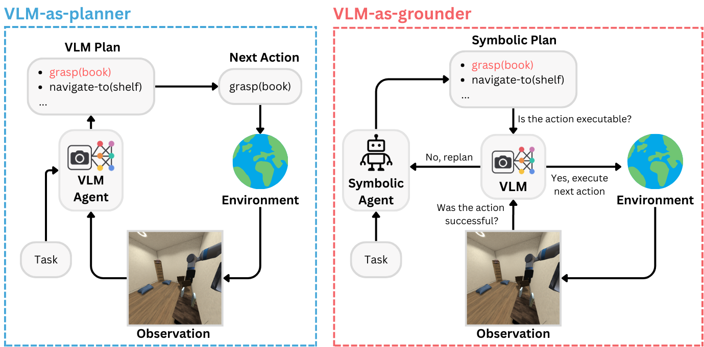

# ViPlan: A Benchmark for Visual Planning with Symbolic Predicates and Vision-Language Models

This codebase contains the implementation of the ViPlan benchmark.



## Project structure

The project is divided into the following main sections:

- Source code: [viplan](viplan/README.md)
- Notebooks: [notebooks](notebooks/README.md) (mostly to visualize results)
- Scripts to run the benchmark: [sh_scripts](sh_scripts/README.md)
- Data: [data](data/README.md)

## Installation

The ViPlan benchmark is made up of several components, including the main experiment code and specific code for the two environments (Blocksworld and Household).

### Experiments

To run the experiments, you need to install the required packages. We recommend using mamba and provide an environment file for easy installation. The virtual environment requirements can be found at `environment.yml`, and it can be created as prefered. Here we report examples using `mamba`.
Using `mamba`:

```bash
mamba env create -p ./viplan_env -f environment.yml
mamba activate ./viplan_env
```

> [!WARNING]
> Using conda is not ufficially supported, but if you want, swap mamba with conda everywhere (also in the sh_scripts) and you should be good.
>  e.g.

```bash
conda env create -p ./viplan_env -f environment.yml
conda activate ./viplan_env
```

If you wish to use Flash Attention, it needs to be installed separately with the following command:

```bash
pip install flash-attn --no-build-isolation
pip install flashinfer-python -i https://flashinfer.ai/whl/cu124/torch2.6/
```

> [!WARNING]
> At the time of writing, Molmo has [an issue](https://huggingface.co/allenai/Molmo-7B-D-0924/discussions/44) with the latest version of `transformers` (>= 4.51.0). To run Molmo, please downgrade `transformers` to version 4.50.3 with `pip install transformers==4.50.3`.

### Environments

The Blocksworld environment is based on the [Photorealistic Blocksworld](https://github.com/IBM/photorealistic-blocksworld) renderer, which is based on Blender. To install the Blender-based renderer, from the root directory of the repository, run the following commands:

```bash
./setup_blocksworld.sh
```

Additionally, the libxi package needs to be installed (e.g., `sudo apt-get install libxi`) or available in the cluster.

#### iGibson

Here is the list of specific requirements to use iGibson:

- `apptainer` (former Singularity)
- Encription key to be requested at [this link](https://docs.google.com/forms/d/e/1FAIpQLScPwhlUcHu_mwBqq5kQzT2VRIRwg_rJvF0IWYBk_LxEZiJIFg/viewform)

The Household environment is instead based on a custom version of [iGibson](https://github.com/StanfordVL/iGibson). 
To install the environment, first clone our fork of iGibson:

```bash
git clone --depth 1 --single-branch --branch release_viplan https://github.com/nicoladainese96/iGibson.git ./iGibson --recursive
git clone https://github.com/StanfordVL/behavior.git
```

Since iGibson requires specific packages, we recommend running it inside a container. Our code is designed to work with [Apptainer](https://apptainer.org). To pull the image, run:

```bash
apptainer cache clean
apptainer pull docker://igibson/igibson:latest
```
This will create a file called `igibson_latest.sif` (it should take approximately 15 minutes), which is expected to be in the root directory. This file is a Singularity image that contains all the dependencies needed to run iGibson. To open a shell inside the container run:
```bash
apptainer exec --nv igibson_latest.sif bash
```

Please notice that to install iGibson, there must be a GPU available. To do that in a SLURM cluster, do for example:
```bash
srun --gpus=1 --mem=40GB --pty apptainer exec --nv igibson_latest.sif bash	
```

Then, install the iGibson dependencies from inside the container:

```bash
python -m venv --system-site-packages ./igibson_env
source igibson_env/bin/activate
pip install -e ./iGibson
pip install -e ./behavior
pip install notebook pyquaternion shapely uvicorn fastapi unified_planning
pip install unified_planning[engines]
```

Afterwards, the iGibson custom assets need to be downloaded following the instructions at [this page](https://stanfordvl.github.io/iGibson/dataset.html):

To download the assets, run:

```bash
cd iGibson
wget --no-check-certificate https://storage.googleapis.com/gibson_scenes/ig_dataset.tar.gz
mkdir igibson/data
tar -xzvf ig_dataset.tar.gz -C ./igibson/data
```

As some of the assets are encrypted, you will need to download the key provided by the iGibson team. The key can be requested by filling out the form at [this link](https://docs.google.com/forms/d/e/1FAIpQLScPwhlUcHu_mwBqq5kQzT2VRIRwg_rJvF0IWYBk_LxEZiJIFg/viewform) and then needs to be placed inside the `iGibson` folder under `igibson/data/igibson.key`.

After this, the iGibson environment is ready to be used. For the benchmark, we use a client-server architecture, where the server runs inside the container and the client runs in the main execution environment. Scripts are provided in the `sh_scripts` folder to run the server and the client.

## Benchmark

To run the benchmark, we provide bash scripts to run locally as well as SLURM scripts that can be used to run the experiments on a cluster. The scripts are located in the `sh_scripts` folder. If you are using a different cluster manager, you may need to modify the scripts at `sh_scripts/slurm_cluster` accordingly. You could also directly run the Python scripts in the `viplan/experiments` directory.

In order to run some open-source models, you might need to accept their conditions on the huggingface hub. Then, you can include your token in the bash environment by running the following command:

```bash
export HF_TOKEN=<your_token>
```

Similarly, in order to run closed-source models, include your API key in the bash environment by running the following command:

```bash
export OPENAI_API_KEY=<your_key>
export GEMINI_API_KEY=<your_key>
export ANTHROPIC_API_KEY=<your_key>
```

## Results

We include all the results from the experiments reported in the paper in the `results` folder. To process and visualize them, we provide Jupyter notebooks in the `notebooks` folder. This reproduces exactly all the Figures and Tables reported in the paper.
